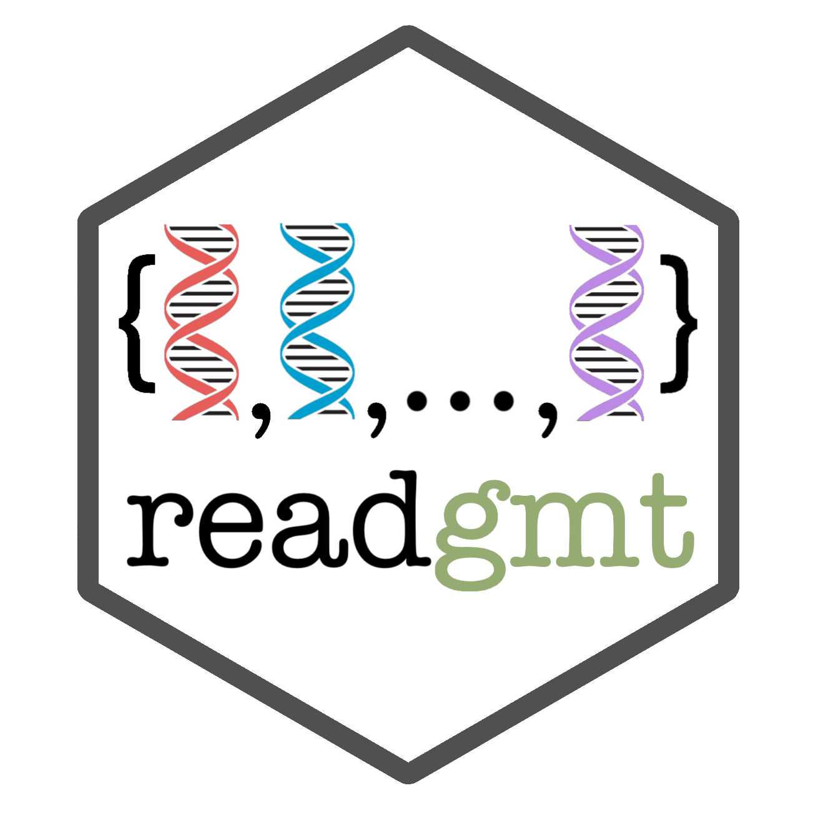

<!-- README.md is generated from README.Rmd. Please edit that file -->

```{r setup, include = FALSE}
knitr::opts_chunk$set(
  collapse = TRUE,
  comment = "#>",
  fig.path = "man/figures/README-",
  out.width = "100%"
)
```
# readgmt <a href="https://jhrcook.github.io/readgmt">  </a>

[](https://www.gnu.org/licenses/gpl-3.0)
[](https://cran.r-project.org/package=readgmt)
[](https://travis-ci.org/jhrcook/readgmt)
[](https://ci.appveyor.com/project/jhrcook/readgmt)
[](https://codecov.io/github/jhrcook/readgmt?branch=master)

The goal of 'readgmt' is to easily import a GMT file from [MSigDB](http://software.broadinstitute.org/gsea/index.jsp) as a list of gene sets.

See the full documentation here: [jhrcook.github.io/readgmt](https://jhrcook.github.io/readgmt)

## Installation

This package is not available on CRAN (it is much too simple for that), so it must be installed from GitHub with

```{r, eval = FALSE}
devtools::install_github("jhrcook/readgmt")
```


## Example

Here is an example of reading in the KEGG gene set (downloaded on 2019/04/01).

```{r, eval = TRUE}
library(readgmt)
kegg_path <- system.file("extdata", "c2.cp.kegg.v6.2.symbols.gmt.txt",
                         package = "readgmt")
kegg <- read_gmt(kegg_path)
head(names(kegg))
head(kegg$KEGG_COLORECTAL_CANCER)
```

This can also be read in as a "tidy" tibble, or converted after the reading it in as a list.

```{r, eval = TRUE}
# read in as a tibble
read_gmt(kegg_path, tidy = TRUE)

# convert from list format to tibble
tidy_gmt(kegg)
```

